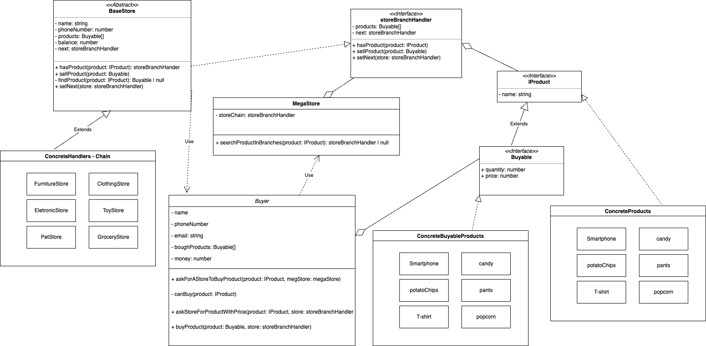

# Chain Of Responsibility
---

`Chain of Responsibility is a behavioral design pattern that lets you pass requests along a chain of handlers. Upon receiving a request, each handler decides either to process the request or to pass it to the next handler in the chain.` [Desing Patterns Guru](https://refactoring.guru/design-patterns/chain-of-responsibility)

[Design Patterns Guru](https://refactoring.guru/design-patterns/chain-of-responsibility)

---

## 01 - Store Branches Example

fonte: [freePik](https://www.freepik.com/free-photo/abstract-blur-defocused-shopping-mall_1255076.htm#query=stores&position=25&from_view=search&track=sph)

### Saiba mais

Esse projeto representa o cenário de uma _MegaStore_ que possui várias filiais, sendo que cada filial é responsável pela venda de determinadas tipos de produtos.

Quando a pessoa utilizadora `Buyer` faz a solicitação de um produto para a `MegaStore`, ela deve verificar em todas as filiais qual vende aquele produto.

Esse exemplo foi criado com o intuito de demonstrar uma das possíveis aplicações do padrão _Chain of Responsibility_, não entrando no mérito se essa é ou não a melhor solução para esse tipo de problema.

Quando o método searchProductsInBranches da `MegaStore` é invocado, ela inicializa a _Chain_ no contexto que foi produzido pelo `client` da aplicação. (Portanto, se faz necessário a construção da _Chain_, atribuindo a cadeia de responsabilidades a cada uma das lojas que fazem parte da `MegaStore`).

É possível ter mais visibilidade sobre a construção desse contexto, observando os [testes](../../../tests/01-comportamentais/02-chain-of-responsibility/01-example-storeBranches/integration/buyProcess.test.ts)

Na aplicação após o produto ser encontrado, a respectiva _Store_ é devolvida. Como se a `MegaStore` estivesse informando onde a pessoa interessada poderia encontrar o produto.

Ciente da _Store_ um `Buyer` pode solicitar o preço do Produto, pois, a príncipio é desconhecido.

Ao receber as informações do `Buyable` ele pode iniciar um processo de compra, enviando um "pedido" a respectiva Store.

Nesse processo, é verificado se há dinheiro suficiente para realizar a compra e se houver a _Store_ realiza a venda do item, fazendo com que o produto seja disponibilizado ao `Buyer`

Obs: As demais implementações do projeto não fazem parte do padrão _Chain Of Responsibility_ (*CoR*). Foram desenvolvidas apenas por diversão 🤩 e para trazer um pouco mais de contexto.

O padrão *CoR* pode ser encontrado na implementação do método _hasProduct_ das classes que extendem a `baseStore`, sendo atualmente:

- [clothingStore](./domain/entities/clothingStore.ts)
- [groceryStore](./domain/entities/groceryStore.ts)

A seguir o diagrama de classes representando melhor o funcionamento da aplicação.

