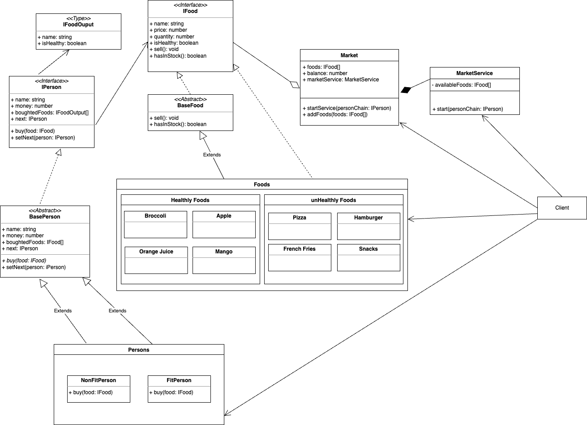

# Chain Of Responsibility
---

`Chain of Responsibility is a behavioral design pattern that lets you pass requests along a chain of handlers. Upon receiving a request, each handler decides either to process the request or to pass it to the next handler in the chain.` [Desing Patterns Guru](https://refactoring.guru/design-patterns/chain-of-responsibility)

[Design Patterns Guru](https://refactoring.guru/design-patterns/chain-of-responsibility)

---

## 02 - Market Service Example

fonte: [freepik](https://br.freepik.com/fotos-gratis/closeup-detalhe-de-uma-mulher-as-compras-em-um-supermercado_5519345.htm#query=market&position=19&from_view=search&track=sph)

### Saiba mais

Nesse exemplo, temos um _Market_ que inicia um serviço _MarketService_ de distribuição de alimentos _healthy_ and _unhealthy_ para várias pessoas.

As regras são:

- Uma `FitPerson`só pode comprar alimentos que sejam _healthy_, desde que haja quantidade suficiente do produto em estoque e que a pessoa tenha dinheiro suficiente.
- Uma `NonFitPerson` só pode comprar alimentos que sejam _unhealthy_ desde que haja quantidade suficiente do produto em estoque e que a pessoa tenha dinheiro suficiente.

Para exemplificar o uso do pattern _ChainOfResponsibility_ cada pessoa tem em sua implementação a responsabilidade de verificar se atende os requisitos de compra, caso não atenda, ela delega para que a próxima pessoa na _Chain_ verifique se faz sentido realizar a compra.

Desse modo, caso novas pessoas, com diferentes regras, incluindo verificação de diferentes propriedades em uma _IFood_, porém que implementem a interface `IPerson`, sejam criadas, poderão ser adicionadas a _Chain_ sem corromper os príncipios _SOLID_.

O gatillho que "dispara" a _Chain_ é o metódo `buy` implementa nas classes extendidas de _BasePerson_ nesse projeto demonstrativo.

Detalhes no Diagrama a seguir:

